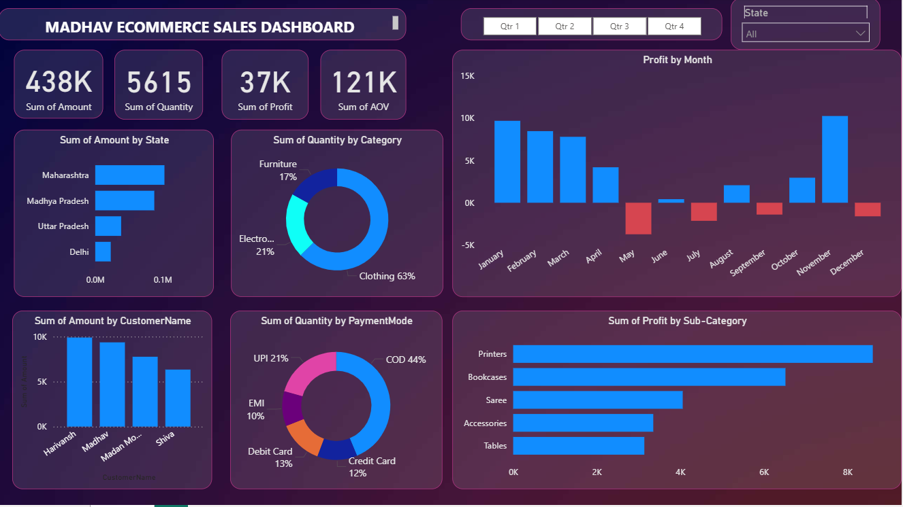

#  E-commerce Sales Dashboard  

This repository contains a **Power BI dashboard** built to analyze and visualize e-commerce sales data for Madhav E-commerce. The dashboard provides insights into sales performance, customer behavior, and profitability across different categories, states, and time periods.  

---

##  Features  

- **Key Metrics Overview**  
  - Total Sales Amount: **438K**  
  - Total Quantity Sold: **5615**  
  - Total Profit: **37K**  
  - Average Order Value (AOV): **121K**  

- **Visual Insights**  
  -  **Profit by Month** – Monthly profit trend with positive and negative months.  
  -  **Sales by State** – Performance comparison across Maharashtra, Madhya Pradesh, Uttar Pradesh, and Delhi.  
  -  **Quantity by Category** – Breakdown into Clothing, Electronics, and Furniture.  
  -  **Top Customers** – Sales contribution by key customers.  
  -  **Quantity by Payment Mode** – Distribution across COD, UPI, Debit Card, Credit Card, and EMI.  
  -  **Profit by Sub-category** – Sub-categories like Printers, Bookcases, Saree, Accessories, and Tables.  

- **Filters & Slicers**  
  - Quarter-wise filter (Q1, Q2, Q3, Q4)  
  - State-wise filter  

---

##  Dashboard Preview  

   

---

##  Tools & Technologies  

- **Power BI Desktop** – For building the interactive dashboard.  
- **DAX (Data Analysis Expressions)** – For calculated measures and KPIs.  
- **Data Modeling** – Relationships between sales, customers, products, and payment data.  

---

## 📂 Repository Structure  

```bash
├── data/                 # Raw/processed datasets (if shared)
├── dashboard/            # Power BI .pbix file
├── images/               # Dashboard screenshots
├── README.md             # Project documentation
```
---

##  Insights from the Dashboard

- Clothing is the most sold category (63% of total quantity).

- Maharashtra contributes the highest sales amount.

- Printers generate the maximum profit among sub-categories.

- COD (Cash on Delivery) is the most preferred payment mode (44%).

- Profit fluctuates throughout the year, with negative months like May, July, September, and December.

---

## Use Cases

- Business decision-making based on sales trends.

- Identifying top-performing states, categories, and customers.

- Understanding payment behavior of customers.

- Tracking seasonal fluctuations in profit.

---

## Contact

- (E-commerce Analytics Project)
-  sushant171020@gmail.com
-  https://www.linkedin.com/in/sushant-556728201?utm_source=share&utm_campaign=share_via&utm_content=profile&utm_medium=ios_app

 This project is for learning and business analytics practice using Power BI.
